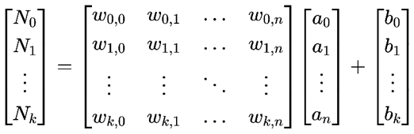
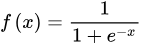
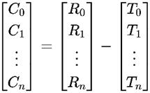
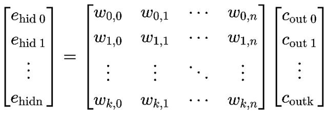
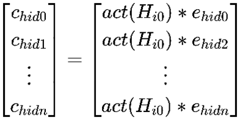
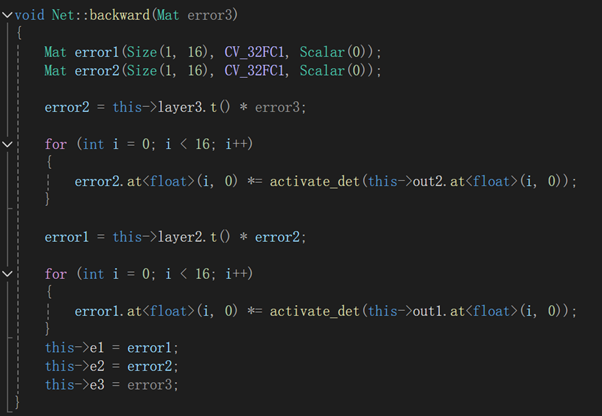
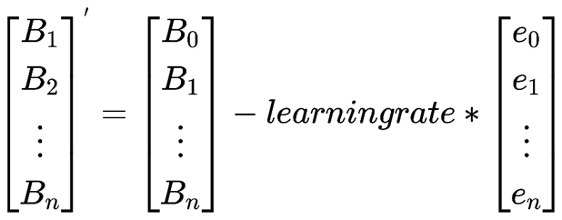
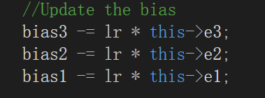
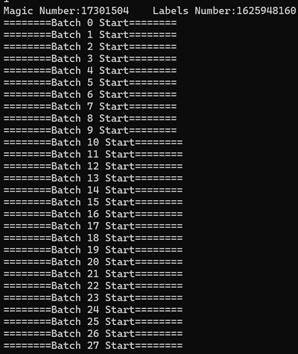
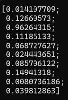

# DNN_Research

**A Simple Example of Neural Network Based on C++**

**The network can identify 28x28 grayscale handwritten numeral**

**The training data come from MINIST**

### content construction

#### main.cpp

**Provides user interface and console options for calling various functions**

#### train.cpp

**The MINIST dataset is used to adjust the weights in the neural network, and the adjusted weights are saved and read**

#### net.cpp

**It contains the main functions of the neural network, such as forward propagation, back propagation, weight adjustment, etc. Using the opencv data type Mat as a matrix, a handwritten digit recognition neural network with 1 input layer, 2 hidden layer and 1 output layer is realized**

### The details of the implementation are stated in the paper

_______________________________________________________

**Abstract**

This research aims to develop a handwritten digit recognition neural network that processes 28*28-pixel grayscale images and outputs the corresponding digit. The study focuses on understanding the principles of Deep Neural Networks (DNN) and the role of linear algebra in deep learning. The network, implemented in C++ to avoid plagiarism issues associated with Python, consists of two hidden layers, an input layer, and an output layer.

The network's structure involves weights and biases, where weights determine neuron connections and biases ensure proper activation. Training involves forward propagation, cost computation, backpropagation, and parameter adjustment. Forward propagation maps input images through the network using weights and biases, followed by an activation function. The cost function measures performance and guides parameter adjustments. The iterative training process refines network parameters for accurate digit recognition.

*Keywords*: DNN; Linear Algebra; Neural Network; Deep Learning; C++

**_______________________________________________________________**

  The goal of this research is to construct a handwritten digit recognition neural network, which has the input of a 28*28 pixels grayscale picture and output the number in the picture. The research mainly aims to help understanding the working principle of DNN (Deep Neural Networks) and explore the applications of linear algebra in deep learning. Thus, the neural network we design has two inner layers, one input layer and one output layer. The program is written in C++, avoid the risks of plagiarize when using Python.

**1.The structure of Neural Network**

  The Neural Network we construct mainly consists of two parts: the weight and the bias. Weight decides how the last neuron connects to the next one. Usually, we use the value of previous neuron multiplies the weight to map the value of next neuron (This step will be shown later). And the bias will be added to the result of weight mapping to ensure the neuron is activated at right time.

Training is the process to adjust the weights and the biases in the neural network, which is the core work to construct the neural network. Training can be divided into four main steps: forward-propagating, compute cost, backpropagation, weight adjustment. After a lot of sample training, the weight and bias will be an appropriate value that can correctly identify most numbers.

**2. Forward Propagation**

  The input image can be converted into a 784*1 column vector by column operation. How can this 784*1 column vector map to the next layer of 16*1 column vector by weight and bias. We can write the weight into a 16*784 matrix whose rows represents the corresponding weight to a certain neuron in the next layer [1]. In addition, the columns of the matrix represent 16 neurons in the next layer. Thus, when this weight matrix is multiplied by the input column vector, it is equivalent to multiplying each input element by a weight and summing the corresponding weights of the specific neurons in the next layer. This process can be expressed as: 

  When considering bias, we only need to subtract the bias as a column vector from the weight map column vector, the complete formula can be expressed as:

  The next step is to calculate the activation function value for each element of the matrix, so that the neural network can arbitrarily approximate any nonlinear function, so that the neural network can be applied to nonlinear models. Here we use Sigmoid Function:

  The results of the function always fall in (0,1).

  By applying the above steps to each layer of the network, the output column vector of the current network can be obtained.

**3. Cost calculation**

  The cost represents how well a network works. High cost means the network should be changed more. In addition, the cost also conducts how to adjust the weight and the bias. From the MINIST [2], we can obtain 60,000 sets of data, and each set is an image and the corresponding label (number). Therefore, we create a result column vector, whose right number is 1 while the others are 0. Then use the result in forward propagation to subtract this vector to obtain the cost.

Also, can be expressed as:

***Cost = Result - Target\***

**4. Backpropagation and Parameter Updating**

In the process of training neural network, the output layer of neural network is often different from the expected output result. To make the output of the neural network reach people's expectation, after each training, the weight, bias and other parameters in the neural network should be adjusted according to the cost. The backpropagation algorithm provides the basis for this adjustment.

After each error between the output layer and the expectation is obtained, the algorithm will judge how each data of the previous hidden layer affects the final result according to the weight of the previous hidden layer to the output layer (the influence of the data in the hidden layer on the output layer) and adjust all the weight of the hidden layer to the output layer so that the output layer can be infinitely close to the expectation. And so on, the weights of each layer will be adjusted. After each training, because the data of each training is different, the weight adjustment is also different after each training. To make the trained neural network have an accurate judgment on each training sample, after a certain number of trainings, the algorithm will find the average value of the weight adjustment and adjust the weight according to the average value.

The specific weight adjustment method is as follows. First, the error of the previous layer is calculated according to the error of the output layer and the expected error. And so on until the error of the first hidden layer is calculated. The calculation formula and code form are as follows(assuming there are i hidden layers and act() is the activate function).

In addition, we need to update the bias. The update method for bias is relatively simple. Primary bias minus learning rate times next level cost. The calculation formula and code form are as follows.

 

**5. Test**

​    Based on our neural network, we have done 60000 times training: 

   Then, we use this well-trained network to execute recognition, we prepare a handwriting ‘2’ as sample:

And the neural network output the result:

We can find the position that represents number two is the most significant.
